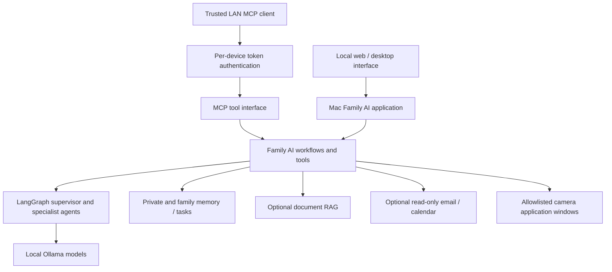

# Family AI

**A local-first AI assistant for the people who share your home.**

Keep shared household tasks and family memories in one place, alongside each
member's personal notes. Chat with local models on your Mac, connect private
knowledge and read-only calendar/email tools, and give trusted devices access
through authenticated MCP.

**Early-stage, macOS-first project.** Core workflows are implemented, but this
public copy still contains configuration placeholders. Optional integrations
need separate setup; this is not yet a one-click household appliance.

## What can you do with it?

| Household need | Available workflow |
| --- | --- |
| Remember something for everyone | Save a family-scoped memory and retrieve it later |
| Keep a personal note | Save a private memory scoped to the current member |
| Coordinate everyday chores | Create personal or shared todos and mark them complete |
| Consult household information | Configure read-only calendar/email access or optional document RAG |
| Monitor a configured camera view | Detect whether people are present, count them, and describe the scene locally |
| Use tools from another trusted device | Connect an MCP client with a per-device bearer token |

Family data is stored in a local database, and core AI inference runs on your
Mac through Ollama. An optional private database backend is also supported.

Optional integrations such as Google services, web search, and the Codex
specialist communicate with external services when used. Their presence alone
does not mean the family database is uploaded. Any stronger claim that no family
data ever leaves the machine requires verification of the data sent by each
integration.

[Local setup](#start-locally-on-the-mac) · [Architecture](#architecture) ·
[Demo script](DEMO.md) · [Roadmap](#roadmap)

## Architecture



FastAPI serves the application; React and Tauri provide the desktop interface.
MCP exposes tools to trusted clients, while LangGraph coordinates agent
workflows. Keep Ollama on loopback and any configured database private.

## Public-copy configuration

Personal values in this public copy are replaced with `*`, including member
names, wake words, email addresses, local paths, host names, LAN addresses,
school names, camera names, camera applications, device names, and tokens.
Replace each required `*` locally before running the corresponding feature.

## Main capabilities

- Local chat and reasoning through Ollama
- LangGraph supervisor with specialist agents
- Private and family-scoped memory
- Shared and personal tasks
- Read-only calendar access
- Read-only email backup
- Optional database-backed document RAG
- Local voice input and speech output
- Permission-limited local camera inspection, person detection, and person counting
- Authenticated Streamable HTTP MCP server
- React/Tauri desktop interface

## Requirements

- macOS host with Python 3.11+, `uv`, and Ollama
- Node.js for the React interface; Rust only for building the Tauri desktop app
- An optional private database when persistent shared storage is required
- Camera applications required by the local configuration: `*`
- A Windows or macOS client with Cline when remote MCP access is needed

Keep `.env`, databases, OAuth credentials, MCP device files, model files,
backups, logs, build output, and generated artifacts out of Git.

## Configuration

Copy the example environment file and replace the required placeholders:

```sh
cp .env.example .env
```

Important settings include:

```dotenv
FAMILY_AI_DATA_DIR=*
DATABASE_URL=*
VOICE_WAKE_WORD=*
GOOGLE_OAUTH_CLIENT_ID=*
GOOGLE_OAUTH_CLIENT_SECRET=*
GMAIL_BACKUP_ROOT=*
FAMILY_AI_MCP_ALLOWED_HOSTS=localhost,127.0.0.1,*,*
```

Use a unique secret for every installation. Do not commit the completed `.env`.

## Start locally on the Mac

Start with text chat, memory, and todos. Voice, camera, Google services, and
RAG can be configured separately.

1. Run `uv sync` in the repository directory.
2. Copy `.env.example` to `.env` if you have not already created it. Set
   `FAMILY_AI_DATA_DIR=./data` and `OLLAMA_MODEL` to an installed Ollama model
   that supports tool calling. `local-main` is a local model name, not a model
   supplied by this repository. Use `ollama list` to inspect installed models.
3. Start Ollama with `ollama serve` in a separate terminal, unless the Ollama
   application is already serving it. Model downloads and hardware requirements
   depend on the model you choose.
4. Start the application bound to your local machine:

   ```sh
   uv run uvicorn family_ai.app:app --host 127.0.0.1 --port 8000
   ```

Open `http://127.0.0.1:8000`. Set the current member field to a simple identifier
such as `demo-parent` (the public default `*` is a placeholder), and use the text
input. Voice requires separately configured models and permissions.

Try these commands in order:

```text
/remember family Recycling pickup is Thursday.
/memory
/todo add family Put the recycling bins out Wednesday evening.
/todo list
```

These are a first workflow check, not a guarantee that all optional integrations
are configured. For LAN access, `./scripts/start.sh` binds to all interfaces;
use only on a trusted network with the application's pairing controls.

Start the MCP server for development with:

```sh
./scripts/start-mcp.sh
```

The packaged runtime includes launchd definitions for the application, Ollama,
MCP server, and scheduled curator. Update every `*` path before installing them.

## Create an MCP device token

Run this command locally on the Mac:

```sh
family-ai-mcp issue-device --name "*" --member "*" --admin
```

The bearer token is displayed once. Store it only on the intended client. The
server stores a SHA-256 token hash in its ignored device registry. Revoke a
client with:

```sh
family-ai-mcp revoke-device "*"
```

The MCP listener accepts loopback, private, and link-local client addresses.
Keep Ollama and the database private; expose only the authenticated MCP port to
the trusted LAN.

## Connect from Windows with Cline

This project has been tested with Cline on another Windows computer using the
Mac as the Family AI server. Both computers must be on the same trusted LAN.

1. Start Family AI, Ollama, and the MCP server on the Mac.
2. In Cline, open **MCP**, then select **Add MCP Server**.
3. Enter a server name such as `family-ai`.
4. Select **Remote** and **Streamable HTTP**.
5. Enter the URL `http://*:8001/mcp`.
6. Add header `Authorization` with value `Bearer *`.
7. Enable the server and refresh its tool list.

Use the Mac LAN IP address or LAN host name in place of the URL's `*`. Use the
per-device token in place of the header's `*`.

Verify the connection from Cline:

```text
Use the family-ai MCP server. Call whoami and system_status.
```

Expected results are an authenticated device identity and overall status
`online`. `loaded_models: []` is normal while Ollama is idle; the configured
model loads on the first local-model request.

If Cline receives `Valid Family AI device token required`, verify the complete
`Authorization: Bearer *` header and ensure the token belongs to an active
device. If the connection is refused, verify port `8001`, the Mac firewall, and
the MCP allowed-host configuration.

## Camera configuration

All camera and camera-application names are intentionally shown as `*` in this
public copy. Configure the local provider mapping and allowlisted window owner
names before enabling camera monitoring. Camera pixels are captured only from
approved application windows and analyzed locally. Apple's Vision framework
performs fast human detection and counting; the configured local Ollama vision
model can answer questions about the current scene.

Example public command form:

```text
/camera * Describe the current view
```

The current public implementation detects people and counts how many are
visible. Its model schema intentionally does not attach a name or identity to a
detected person. Automatic monitoring is disabled by default and must be
explicitly configured locally.

## Email and calendar

Email backup uses read-only OAuth access. Tokens remain in the macOS Keychain.
Backups can be stored on a configured removable drive and optionally mirrored
in the database. Calendar access is read-only.

Configure the OAuth client ID, secret, and redirect URI in `.env`. Supported
commands include:

```text
/gmail connect
/gmail backup
/gmail status
/gmail disconnect
```

## Private knowledge RAG

An optional database backend can store document embeddings and application
state. Its host, schema, credentials, and deployment details are intentionally
omitted from this public copy. Private documents are scoped to one member;
family documents are shared. Retrieved excerpts are added only to the local
model context.

## Security notes

- MCP requires a separate bearer token for every client device.
- MCP device tokens are stored as hashes by the server.
- Ollama should listen on loopback only.
- The configured database should remain private and require authentication.
- Credentials and personal data belong only in ignored runtime files.
- Camera access is limited to configured local application windows.
- Codex requests exclude credentials, databases, memories, and conversation
  history from sanitized project copies.

## Tests

```sh
uv run pytest -q
```

Desktop build configuration is under `desktop/`; macOS launchd definitions are
under `launchd/`.

## Roadmap

These are planned directions, not currently promised capabilities:

- Make a fresh installation reproducible, with fewer placeholders and clearer diagnostics.
- Add a recorded demo using synthetic household data and document hardware/model requirements.
- Improve member onboarding and explain access boundaries for shared devices.
- Explore opt-in sensor events and reminders with explicit permissions.
- Explore home-device and robotics integrations after the core household workflows are reliable.

Identity-by-face, arrival-triggered reminders, Home Assistant integration, and
robot control are not advertised as current features in this public copy.
